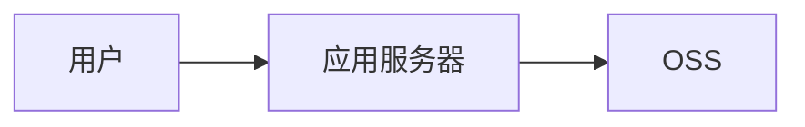
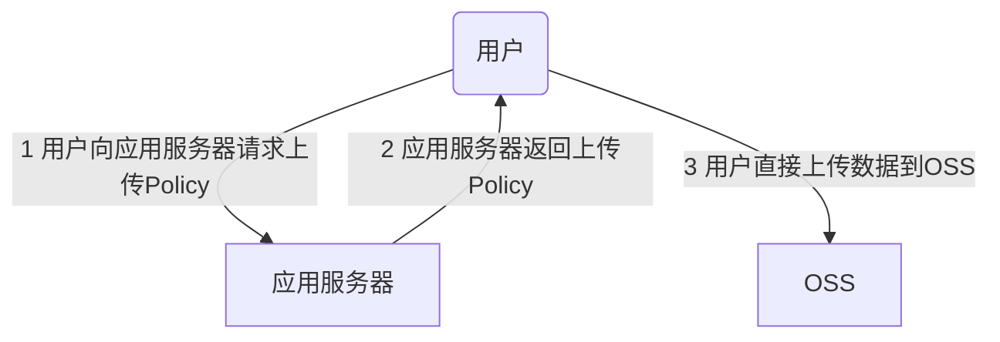

# 5.文件存储

## 上传方式

### 普通上传



### 服务端签名后直传



## ~~java SDK~~

- 安装

  ```xml
  <dependency>
      <groupId>com.aliyun.oss</groupId>
      <artifactId>aliyun-sdk-oss</artifactId>
      <version>3.10.2</version>
  </dependency>
  ```

- 上传文件流

  ```java
  @Test
  public void testUpload() throws FileNotFoundException {
      // yourEndpoint填写Bucket所在地域对应的Endpoint。以华东1（杭州）为例，Endpoint填写为https://oss-cn-hangzhou.aliyuncs.com。
      String endpoint = "yourEndpoint";
      // 阿里云账号AccessKey拥有所有API的访问权限，风险很高。强烈建议您创建并使用RAM用户进行API访问或日常运维，请登录RAM控制台创建RAM用户。
      String accessKeyId = "yourAccessKeyId";
      String accessKeySecret = "yourAccessKeySecret";
  
      // 创建OSSClient实例。
      OSS ossClient = new OSSClientBuilder().build(endpoint, accessKeyId, accessKeySecret);
  
      // 填写本地文件的完整路径。如果未指定本地路径，则默认从示例程序所属项目对应本地路径中上传文件流。
      InputStream inputStream = new FileInputStream("D:\\localpath\\examplefile.txt");
      // 依次填写Bucket名称（例如examplebucket）和Object完整路径（例如exampledir/exampleobject.txt）。Object完整路径中不能包含Bucket名称。
      ossClient.putObject("examplebucket", "exampledir/exampleobject.txt", inputStream);
  
      // 关闭OSSClient。
      ossClient.shutdown();
  }
  ```

## Aliyun Spring Boot OSS

- `pom.xml`引入

  ```xml
  <dependency>
      <groupId>com.alibaba.cloud</groupId>
      <artifactId>aliyun-oss-spring-boot-starter</artifactId>
  </dependency>
  ```

- `application.yml`

  ```yaml
  alibaba:
    cloud:
      access-key: your-ak
      secret-key: your-sk
      oss:
        endpoint: ***
  ```

- test

  ```java
  @Test
  public void testUpload() throws FileNotFoundException {
      // 填写本地文件的完整路径。如果未指定本地路径，则默认从示例程序所属项目对应本地路径中上传文件流。
      InputStream inputStream = new FileInputStream("E:\\Pictures\\logo\\apple.jpg");
      // 依次填写Bucket名称（例如examplebucket）和Object完整路径（例如exampledir/exampleobject.txt）。Object完整路径中不能包含Bucket名称。
      ossClient.putObject("ttmall-20210820", "aaa.jpg", inputStream);
  
      // 关闭OSSClient。
      ossClient.shutdown();
  
      System.out.println("上传成功");
  }
  ```

  

## 创建第三方服务（third-party）- 配置oss

- 创建`module`

  引入`web`、`openFeign`

- `pom.xml`

  ```xml
  <dependencies>
      <dependency>
          <groupId>cn.tete.ttmall</groupId>
          <artifactId>ttmall-common</artifactId>
          <version>0.0.1-SNAPSHOT</version>
      </dependency>
      <dependency>
          <groupId>com.alibaba.cloud</groupId>
          <artifactId>aliyun-oss-spring-boot-starter</artifactId>
          <version>1.0.0</version>
      </dependency>
  </dependencies>
  
  <dependencyManagement>
      <dependencies>
          <dependency>
              <groupId>org.springframework.cloud</groupId>
              <artifactId>spring-cloud-dependencies</artifactId>
              <version>${spring-cloud.version}</version>
              <type>pom</type>
              <scope>import</scope>
          </dependency>
          <dependency>
              <groupId>com.alibaba.cloud</groupId>
              <artifactId>spring-cloud-alibaba-dependencies</artifactId>
              <version>2.1.2.RELEASE</version>
              <type>pom</type>
              <scope>import</scope>
          </dependency>
      </dependencies>
  </dependencyManagement>
  ```

- `bootstrap.yml`

  ```yaml
  spring:
    application:
      name: ttmall-third-party
    cloud:
      nacos:
        config:
          server-addr: 127.0.0.1:8848
          namespace: 59c5d7c5-a73e-4856-b2f7-21679b5ad5fa
          ext-config:
            - data-id: oss.yml
              group: DEFAULT_GROUP
              refresh: true
  ```

- `nacos`配置中心 - `oss.yml`

  ```yaml
  spring:
    cloud:
      alicloud:
        access-key: xx
        secret-key: xx
        oss:
          endpoint: xx
  ```

  

- 服务端签名后直传

  [地址](https://help.aliyun.com/document_detail/31926.html?spm=a2c4g.11186623.0.0.1607344eE0lrYB)

  - 签名直传服务

    > Controller

    ```java
    import com.aliyun.oss.OSS;
    import com.aliyun.oss.common.utils.BinaryUtil;
    import com.aliyun.oss.model.MatchMode;
    import com.aliyun.oss.model.PolicyConditions;
    import org.springframework.beans.factory.annotation.Autowired;
    import org.springframework.beans.factory.annotation.Value;
    import org.springframework.web.bind.annotation.RequestMapping;
    import org.springframework.web.bind.annotation.RestController;
    
    import java.io.UnsupportedEncodingException;
    import java.text.SimpleDateFormat;
    import java.util.Date;
    import java.util.LinkedHashMap;
    import java.util.Map;
    
    @RestController
    public class OssController {
    
        @Autowired
        OSS ossClient;
    
        @Value("${spring.cloud.alicloud.oss.endpoint}")
        private String endpoint;
    
        @Value("${spring.cloud.alicloud.oss.bucket}")
        private String bucket;
    
        @Value("${spring.cloud.alicloud.oss.access-key}")
        private String accessId;
    
        @RequestMapping()
        public Map<String, String> policy() {
            String host = "https://" + bucket + "." + endpoint; // host的格式为 bucketname.endpoint
            // callbackUrl为上传回调服务器的URL，请将下面的IP和Port配置为您自己的真实信息。
            String callbackUrl = "http://88.88.88.88:8888";
    
            String format = new SimpleDateFormat("yyyy-MM-dd").format(new Date());
    
            String dir = format + "/"; // 用户上传文件时指定的前缀。
    
            long expireTime = 30;
            long expireEndTime = System.currentTimeMillis() + expireTime * 1000;
            Date expiration = new Date(expireEndTime);
            // PostObject请求最大可支持的文件大小为5 GB，即CONTENT_LENGTH_RANGE为5*1024*1024*1024。
            PolicyConditions policyConds = new PolicyConditions();
            policyConds.addConditionItem(PolicyConditions.COND_CONTENT_LENGTH_RANGE, 0, 1048576000);
            policyConds.addConditionItem(MatchMode.StartWith, PolicyConditions.COND_KEY, dir);
    
            String postPolicy = ossClient.generatePostPolicy(expiration, policyConds);
            byte[] binaryData = new byte[0];
            try {
                binaryData = postPolicy.getBytes("utf-8");
            } catch (UnsupportedEncodingException e) {
                e.printStackTrace();
            }
            String encodedPolicy = BinaryUtil.toBase64String(binaryData);
            String postSignature = ossClient.calculatePostSignature(postPolicy);
    
            Map<String, String> respMap = new LinkedHashMap<String, String>();
            respMap.put("accessid", accessId);
            respMap.put("policy", encodedPolicy);
            respMap.put("signature", postSignature);
            respMap.put("dir", dir);
            respMap.put("host", host);
            respMap.put("expire", String.valueOf(expireEndTime / 1000));
            // respMap.put("expire", formatISO8601Date(expiration));
            return respMap;
        }
    
    }
    ```

- 网关配置

  ```yml
  - id: third_party_route
    uri: lb://ttmall-third-party
    predicates:
      - Path=/api/thirdparty/**
    filters:
      - RewritePath=/api/thirdparty/(?<segment>.*),/$\{segment}
  ```

- 测试

  [地址](http://localhost:88/api/thirdparty/oss/policy)

## 前端页面

- 新增组件

> `multiUpload.vue`

```vue
<template>
  <div>
    <el-upload
      action="ttmall-20210820.oss-cn-shanghai.aliyuncs.com"
      :data="dataObj"
      list-type="picture-card"
      :file-list="fileList"
      :before-upload="beforeUpload"
      :on-remove="handleRemove"
      :on-success="handleUploadSuccess"
      :on-preview="handlePreview"
      :limit="maxCount"
      :on-exceed="handleExceed"
    >
      <i class="el-icon-plus"></i>
    </el-upload>
    <el-dialog :visible.sync="dialogVisible">
      
    </el-dialog>
  </div>
</template>
<script>
import { policy } from "./policy";
import { getUUID } from '@/utils'
export default {
  name: "multiUpload",
  props: {
    //图片属性数组
    value: Array,
    //最大上传图片数量
    maxCount: {
      type: Number,
      default: 30
    }
  },
  data() {
    return {
      dataObj: {
        policy: "",
        signature: "",
        key: "",
        ossaccessKeyId: "",
        dir: "",
        host: "",
        uuid: ""
      },
      dialogVisible: false,
      dialogImageUrl: null
    };
  },
  computed: {
    fileList() {
      let fileList = [];
      for (let i = 0; i < this.value.length; i++) {
        fileList.push({ url: this.value[i] });
      }

      return fileList;
    }
  },
  mounted() {},
  methods: {
    emitInput(fileList) {
      let value = [];
      for (let i = 0; i < fileList.length; i++) {
        value.push(fileList[i].url);
      }
      this.$emit("input", value);
    },
    handleRemove(file, fileList) {
      this.emitInput(fileList);
    },
    handlePreview(file) {
      this.dialogVisible = true;
      this.dialogImageUrl = file.url;
    },
    beforeUpload(file) {
      let _self = this;
      return new Promise((resolve, reject) => {
        policy()
          .then(response => {
            console.log("这是什么${filename}");
            _self.dataObj.policy = response.data.policy;
            _self.dataObj.signature = response.data.signature;
            _self.dataObj.ossaccessKeyId = response.data.accessid;
            _self.dataObj.key = response.data.dir + "/"+getUUID()+"_${filename}";
            _self.dataObj.dir = response.data.dir;
            _self.dataObj.host = response.data.host;
            resolve(true);
          })
          .catch(err => {
            console.log("出错了...",err)
            reject(false);
          });
      });
    },
    handleUploadSuccess(res, file) {
      this.fileList.push({
        name: file.name,
        // url: this.dataObj.host + "/" + this.dataObj.dir + "/" + file.name； 替换${filename}为真正的文件名
        url: this.dataObj.host + "/" + this.dataObj.key.replace("${filename}",file.name)
      });
      this.emitInput(this.fileList);
    },
    handleExceed(files, fileList) {
      this.$message({
        message: "最多只能上传" + this.maxCount + "张图片",
        type: "warning",
        duration: 1000
      });
    }
  }
};
</script>
<style>
</style>
```

> `policy.js`

```js
import http from '@/utils/httpRequest.js'
export function policy() {
   return  new Promise((resolve,reject)=>{
        http({
            url: http.adornUrl("/thirdparty/oss/policy"),
            method: "get",
            params: http.adornParams({})
        }).then(({ data }) => {
            resolve(data);
        })
    });
}
```


> `singleUpload.vue`

```vue
<template> 
  <div>
    <el-upload
      action="http://gulimall.oss-cn-shanghai.aliyuncs.com"
      :data="dataObj"
      list-type="picture"
      :multiple="false" :show-file-list="showFileList"
      :file-list="fileList"
      :before-upload="beforeUpload"
      :on-remove="handleRemove"
      :on-success="handleUploadSuccess"
      :on-preview="handlePreview">
      <el-button size="small" type="primary">点击上传</el-button>
      <div slot="tip" class="el-upload__tip">只能上传jpg/png文件，且不超过10MB</div>
    </el-upload>
    <el-dialog :visible.sync="dialogVisible">
      
    </el-dialog>
  </div>
</template>
<script>
   import {policy} from './policy'
   import { getUUID } from '@/utils'

  export default {
    name: 'singleUpload',
    props: {
      value: String
    },
    computed: {
      imageUrl() {
        return this.value;
      },
      imageName() {
        if (this.value != null && this.value !== '') {
          return this.value.substr(this.value.lastIndexOf("/") + 1);
        } else {
          return null;
        }
      },
      fileList() {
        return [{
          name: this.imageName,
          url: this.imageUrl
        }]
      },
      showFileList: {
        get: function () {
          return this.value !== null && this.value !== ''&& this.value!==undefined;
        },
        set: function (newValue) {
        }
      }
    },
    data() {
      return {
        dataObj: {
          policy: '',
          signature: '',
          key: '',
          ossaccessKeyId: '',
          dir: '',
          host: '',
          // callback:'',
        },
        dialogVisible: false
      };
    },
    methods: {
      emitInput(val) {
        this.$emit('input', val)
      },
      handleRemove(file, fileList) {
        this.emitInput('');
      },
      handlePreview(file) {
        this.dialogVisible = true;
      },
      beforeUpload(file) {
        let _self = this;
        return new Promise((resolve, reject) => {
          policy().then(response => {
            _self.dataObj.policy = response.data.policy;
            _self.dataObj.signature = response.data.signature;
            _self.dataObj.ossaccessKeyId = response.data.accessid;
            _self.dataObj.key = response.data.dir + '/'+getUUID()+'_${filename}';
            _self.dataObj.dir = response.data.dir;
            _self.dataObj.host = response.data.host;
            resolve(true)
          }).catch(err => {
            reject(false)
          })
        })
      },
      handleUploadSuccess(res, file) {
        console.log("上传成功...")
        this.showFileList = true;
        this.fileList.pop();
        this.fileList.push({name: file.name, url: this.dataObj.host + '/' + this.dataObj.key.replace("${filename}",file.name) });
        this.emitInput(this.fileList[0].url);
      }
    }
  }
</script>
```

