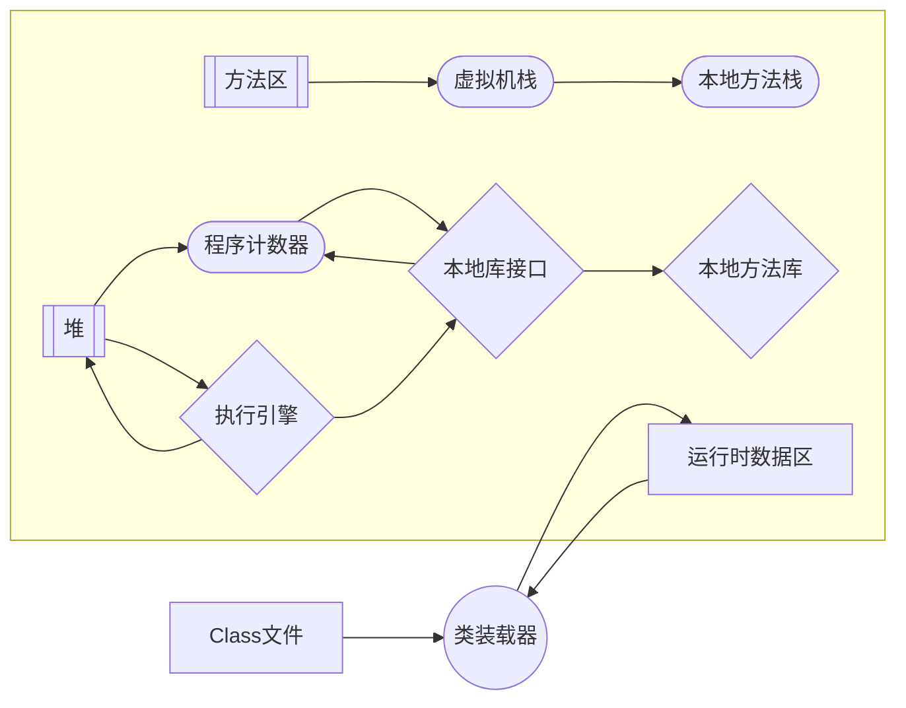
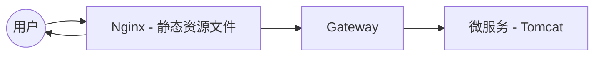

# 18.压力测试

压力测试考察当前软硬件环境下系统所能承受的最大负荷并帮助找出系统瓶颈所在。压测都是为了系统线上的处理和稳定性维持在一个标准范围内，做到心中有数。

使用压力测试，我们有希望找到很多种用其他测试方法很难发现的错误。有两种错误类型是：**内存泄漏**，**并发与同步**

有效的压力测试将应用以下这些关键条件：**重复**、**并发**、**量级**、**随机变化**。

## 性能指标

- 响应时间（Response Time：RT）

  响应时间指用户从客户端发起一个请求开始，到客户端接收从服务器端返回的响应结束，整个国所耗费的时间。

- HPS（Hits Per Second）：系统每秒处理交易数，单位是笔/秒。

- TPS（Transaction per Second）：系统每秒处理查询次数，单位是次/秒。

  对于互联网业务中，如果某些业务有且仅有一个请求连接，那么TPS=QPS=HPS，一般情况下用TPS来衡量整个业务流程，用QPS来衡量接口查询次数，用HPS来表示对服务器单击请求。

- 无论TPS、QPS、HPS，此指标是衡量系统处理能力非常重要的指标，越大越好，根据经验，一般情况下：

  金融行业：1000TPS~50000TPS，不包括互联网化的活动

  保险行业：100TPS~100000TPS

  制造行业：10TPS~5000TPS

  互联网电子商务：10000TPS~1000000TPS

  互联网中型网站：100TPS~50000TPS

  互联网小型网站：500TPS~10000TPS

- 最大响应时间（Max Response Time）指用户发出请求或者指令到系统做出反应（响应）的最大时间。

- 最少响应时间（Mininum Response Time）指用户发出请求或者指令到系统做出反应（响应）的最少时间。

- 90%响应时间（90% Response Time）是指所有用户的响应时间进行排序，第90%的响应时间。

- 从外部开，性能测试主要关注如下三个指标

  吞吐量：每秒钟系统能够处理的请求数、任务数。

  响应时间：服务处理一个请求或一个任务的耗时。

  错误率：一批请求中结果出错的请求所占比例。

## JMeter

### JMeter Address Already in use 错误解决

`windowns`本身提供的端口访问机制的问题

`windowns`提供给TCP/IP链接的端口为1024-5000，并且要四分钟循环回收他们。就导致我们在短时间内跑大量的请求时将端口占满了。

1. `cmd`中，用`regedit`命令打开注册表
2. 在`HKEY_LOCAL_MACHINE\SYSTEM\CurrentControlSet\Tcpip\Parameters`下，
   1. 邮件parameters，添加一个新的DWORD，名字为`MaxUserPort`
   2. 然后双击`MaxUserPort`，输入数值数据为65534，基数选择十进制（如果是分布式运行的化，控制机器负载机器都需要这样操作）
   3. 修改配置完毕之后记得重启机器才会生效

> `TCPTimeWaitDelay：30`

[错误 WSAENOBUFS (10055) - Windows Client | Microsoft Docs](https://docs.microsoft.com/zh-cn/troubleshoot/windows-client/networking/connect-tcp-greater-than-5000-error-wsaenobufs-10055)

## 堆内存与垃圾回收

### `jvm`内存模型

...

### `jconsole`与`jvisualvm`

JDK的两个小工具`jconsole`、`jvisualvm`（升级版的`jconsole`）；通过命令行启动，可监控本地和远程应用。远程应用需要配置

##### `jvisualvm`能干什么

监控内存泄露，跟踪垃圾回收，执行时内存、`cpu`分析，线程分析...

**运行**：正在运行的

**休眠**：sleep

**等待**：wait

**驻留**：线程池里面的空闲线程

**监视**：阻塞的线程，正在等待锁

##### 安装插件方便查看GC

- `cmd`启动`jvisualvm`

- 工具->插件

- 如果503错误

  解决：

  - 打开网址：https://visualvm.github.io/pluginscenters.html
  - cmd查看自己的jdk版本，找到对应的
  - 复制下面查询出来的连接，并重新设置上即可

- 如果插件下载失败，可是尝试本地安装。

### 压测内容

| 压测内容                                            | 压测线程数 | 吞吐量/s                    | 90%响应时间 | 99%响应时间 |
| --------------------------------------------------- | ---------- | --------------------------- | ----------- | ----------- |
| Nginx                                               | 50         | 5,726                       | 5           | 130         |
| Gateway                                             | 50         | 13,272                      | 6           | 22          |
| 简单服务                                            | 50         | 13,586                      | 5           | 74          |
| 首页一级菜单渲染                                    | 50         | 559（`db`、`thymeleaf`）.12 | 218         | 483         |
| 首页渲染（打开`thymeleaf`缓存）                     | 50         | 22                          | 3095        | 3509        |
| 首页渲染（打开`thymeleaf`缓存、优化数据库、关日志） | 50         | 1,302                       | 82          | 230         |
| 三级分类数据获取                                    | 50         | 13/18（db）                 | 5395        | 6659        |
| 三级分类数据获取                                    |            |                             |             |             |
| 首页全量数据获取                                    | 50         | 15/30（静态资源）           | 4583        | 5470        |
| Nginx + Gateway                                     | 50         |                             |             |             |
| Gateway + 简单服务                                  | 50         | 3,830                       | 29          | 67          |
| 全链路                                              | 50         | 756                         | 86          | 124         |

- 中间件越多，性能损失越大，大多都损失在网络交互了；
- 业务：
  - db（MySQL优化）
  - 模板的渲染速度（缓存）
  - 静态资源

### Nginx动静分离

1. 以后将所有项目的静态资源都应该放在ngin里面
2. 规则：`/staic/**`所有请求都由Nginx直接返回