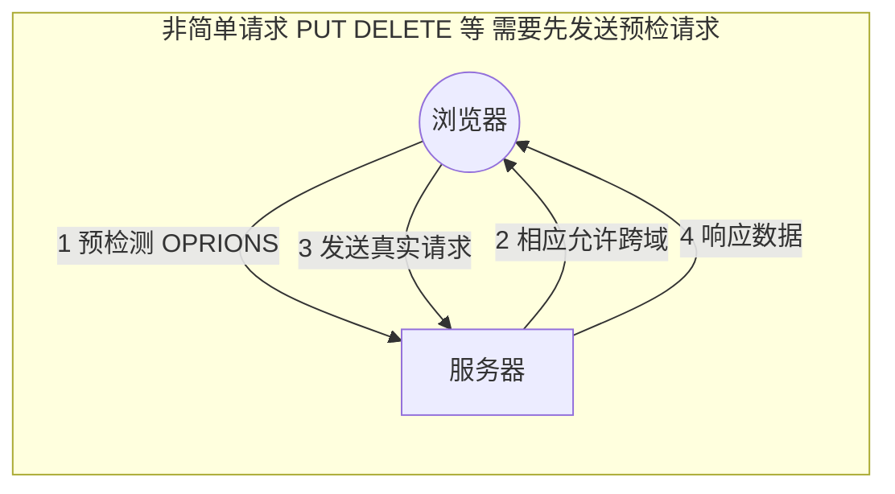
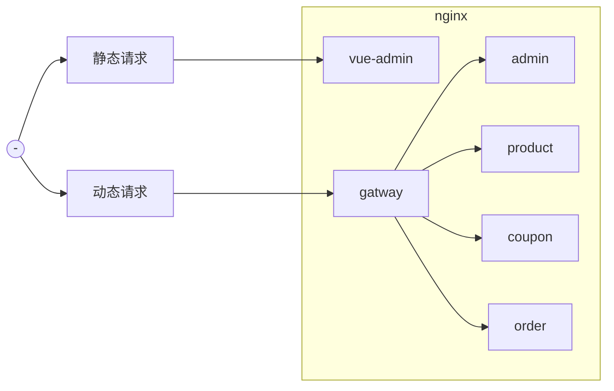

# 4.跨域

## 简介

跨域值得是浏览器不能执行其它网站的脚本。它是由浏览器的同源策略造成的，是浏览器对`javascript`施加的安全限制。

- **同源策略**：是指协议，域名，端口都要相同，其中有一个不同都会产生跨域；

  | url                                                     | 说明                           | 是否允许通信                           |
  | ------------------------------------------------------- | ------------------------------ | -------------------------------------- |
  | http://www.a.com/a.js，http://www.a.com/b.js            | 同一域名下                     | 允许                                   |
  | http://www.a.com/lab/a.js，http://www.a.com/script/b.js | 同一域名下不同文件夹           | 允许                                   |
  | http://www.a.com:8000/a.js，http://www.a.com/b.js       | 同一域名，不同端口             | 不允许                                 |
  | http://www.a.com/a.js，https://www.a.com/b.js           | 同一域名，不统协议             | 不允许                                 |
  | http://www.a.com/a.js，http://70.32.92.74/b.js          | 域名和域名对应ip               | 不允许                                 |
  | http://www.a.com/a.js，http://script.a.com/b.js         | 主域相同，子域不同             | 不允许                                 |
  | http://www.a.com/a.js，http://a.com/b.js                | 同一域名，不统二级域名（同上） | 不允许（cookie这种情况下也不允许访问） |
  | http://www.cnblogs.com/a.js，http://a.com/b.js          | 不同域名                       | 不允许                                 |

  

## 流程



## 解决跨域

### 使用nginx部署为同一域




### 配置当次请求允许跨域

- 添加响应头
  - Access-Control-Allow-Origin：支持哪些来源的请求跨域
  - Access-Control-Allow-Methods：支持哪些方法跨域
  - Access-Control-Allow-Credentials：跨域请求默认不包含cookie，设置为true可以包含cookie
  - Access-Control-Expose-Headers：跨域请求暴露的字段
    - CORS请求时，XMLHttpRequest对象的getResponseHeader()方法只能拿到6个基本字段：Cache-Control、Content-Language、Content-type、Expires、Last-Modified、Pragma。如果想拿到其它字段，就必须在Access-Control-Expose-Headers里面指定。
    - Access-Control-Max-Age：表明该响应的有效时间为多少秒。在有效时间内，浏览器无须为同一请求再次发起预检请求。请注意，浏览器自身维护了一个最大有效时间，如果该首部字段的值超过了最大有效时间，将不会生效。

## 实现

```java
package cn.tete.ttmall.gatway.config;

import org.springframework.context.annotation.Bean;
import org.springframework.context.annotation.Configuration;
import org.springframework.web.cors.CorsConfiguration;
import org.springframework.web.cors.reactive.CorsWebFilter;
import org.springframework.web.cors.reactive.UrlBasedCorsConfigurationSource;

@Configuration
public class TtmallCorsConfiguration {

    @Bean
    public CorsWebFilter corsWebFilter(){
        UrlBasedCorsConfigurationSource source = new UrlBasedCorsConfigurationSource();

        CorsConfiguration corsConfiguration = new CorsConfiguration();

        // 1、配置跨域
        corsConfiguration.addAllowedHeader("*");
        corsConfiguration.addAllowedMethod("*");
        corsConfiguration.addAllowedOrigin("*");
        corsConfiguration.setAllowCredentials(true);

        source.registerCorsConfiguration("/**", corsConfiguration);
        return new CorsWebFilter(source);
    }

}
```

> 去除原先配置跨域

## 逻辑删除

- 配置全局逻辑删除规则

  `application.yml`

  ```yaml
  mybatis-plus:
    global-config:
      db-config:
        logic-delete-value: 1
        logic-not-delete-value: 0
  ```

- 加上逻辑删除注解`@TableLogic`

  ```java
  /**
   * 是否显示[0-不显示，1显示]
   */
  @TableLogic(value = "1", delval = "0")
  private Integer showStatus;
  ```
