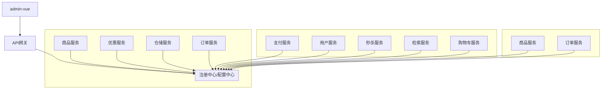

# 1.环境.md

## 虚拟机

> 冲突软件：红蜘蛛，360，净网大师（有可能）等,卸载冲突软件，并重启。

### 安装VirtualBox

[官网](https://www.virtualbox.org/)

[Windowns下载](https://download.virtualbox.org/virtualbox/6.1.22/VirtualBox-6.1.22-144080-Win.exe)

### 安装vagrant

[下载](https://www.vagrantup.com/downloads)

### vagrant的使用

- 测试是否安装完成

```powershell
vagrant
```


- 安装cent os 7

[vagrant镜像](https://app.vagrantup.com/boxes/search)

```powershell
vagrant init centos/7
vagrant up
```


- 连接虚拟机

```powershell
vagrant ssh
```


### 网络环境设置

- 查看本机的VirtyalBox地址

```shell
$> ipconfig
以太网适配器 VirtualBox Host-Only Network:

   连接特定的 DNS 后缀 . . . . . . . :
   本地链接 IPv6 地址. . . . . . . . : fe80::a864:78d0:94f9:8ddd%10
   IPv4 地址 . . . . . . . . . . . . : 192.168.56.1
   子网掩码  . . . . . . . . . . . . : 255.255.255.0
```


- 修改`vagrantfile`

```
# 修改为同一频段的
config.vm.network "private_network", ip: "192.168.56.10"
```

- 重启vagrant

```shell
vagrant reload
```

- 测试

  - 虚拟机

  ```shell
  ping 主机地址
  ```

  - 主机

  ```shell
  ping 虚拟机地址
  ```

### 开启远程连接

```shell
$ vi /etc/ssh/sshd_config
# 修改 PasswordAuthentication yes/no
# 重启服务
$ service sshd restart
```


## linux

### 增加外网配置

```shell
$ cd /etc/sysconfig/network-scripts/
$ vi ifcfg-eth1
~
NM_CONTROLLED=yes
BOOTPROTO=none
ONBOOT=yes
IPADDR=192.168.56.105
NETMASk=255.255.255.0
DEVICE=eth1
PEERDNS=no
GETWAY=192.168.56.1
DNS1=114.114.114.114
DNS2=8.8.8.8

$ service network restart
```

### 修改yum源

```shell
# 备份原yum源
$ mv /etc/yum.repos.d/CentOS-Base.repo /etc/yum.repos.d/CentOS-Base.repo.backup
# 使用新yum源
$ curl -o /etc/yum.repos.d/CentOS-Base.repo http://mirrors.163.com/.help/CentOS7-Base-163.repo
# 生成缓存
$ yum makecache
```


### 安装常用工具

```shell
# wget
$ yum install -y wget
# unzip
$ yum install -y unzip
```


### 安装docker

参考[官方文档](https://docs.docker.com/engine/install/centos/)

- 删除原有的docker

```shell
$ sudo yum remove docker \
                  docker-client \
                  docker-client-latest \
                  docker-common \
                  docker-latest \
                  docker-latest-logrotate \
                  docker-logrotate \
                  docker-engine
```

- 设置存储库

```shell
$ sudo yum install -y yum-utils
$ sudo yum-config-manager \
    --add-repo \
    https://download.docker.com/linux/centos/docker-ce.repo
```

- 安装docker

```shell
$ sudo yum install -y docker-ce docker-ce-cli containerd.io
```

- 启动

```shell
$ sudo systemctl start docker
```

- 设置开机自启

```shell
$ sudo systemctl enable docker
```

- 测试

```shell
$ sudo docker images
```

- 配置镜像加速

[阿里云](https://cr.console.aliyun.com/cn-hangzhou/instances/mirrors)

### docker安装mysql

[docker hub](https://registry.hub.docker.com/_/mysql)

- 下载镜像

```shell
docker pull mysql:5.7
```

- 创建实例并启动

```shell
# 切换至root
$ su root
~ password:vagrant
$ docker run -p 3306:3306 --name mysql \
-v /mydata/mysql/log:/var/log/mysql \
-v /mydata/mysql/data:/var/lib/mysql \
-v /mydata/mysql/conf:/etc/mysql \
-e MYSQL_ROOT_PASSWORD=root \
-d mysql:5.7
```

- mysql配置

```shell
$ cd /mydata/mysql/conf
$ vi my.cnf
~   
[client]
default-character-set=utf8

[mysql]
default-character-set=utf8

[mysqld]
init_connect='SET collation_connection = utf8_unicode_ci'
init_connect='SET NAMES utf8'
character-set-server=utf8
collation-server=utf8_unicode_ci
skip-character-set-client-handshake
skip-name-resolve
```

- 重启docker

```shell
$ docker restart mysql
```

### docker安装redis

- 下载镜像

```shell
$ docker pull redis
```

- 创建并启动实例

```shell
$ mkdir -p /mydata/redis/conf
$ touch /mydata/redis/conf/redis.conf
# 启动
$ docker run -p 6379:6379 --name redis -v /mydata/redis/data:/data \
-v /mydata/redis/conf/redis:/etc/redis/redis.conf \
-d redis redis-server /etc/redis/redis.conf
```

- `redis`持久化

```shell
$ vim /mydata/redis/conf/redis.conf
~
appendonly yes
```

> 其余配置参考[`redis`官方配置](https://redis.io/topics/config)

- 开机自启

```shell
sudo docker update redis --restart=always
```


### docker安装nginx

```shell
# 随便启动一个nginx实例，只是为了复制出配置
$ docker run -p 80:80 --name nginx -d nginx:1.10
# 将容器内的配置文件拷贝到当前目录
$ docker container cp nginx:/etc/nginx .
$ mv nginx/ conf
$ mkdir nginx
$ mv conf/ nginx/
# 创建容器
$ docker run -p 80:80 --name nginx \
-v /mydata/nginx/html:/usr/share/nginx/html \
-v /mydata/nginx/logs:/var/log/nginx \
-v /mydata/nginx/conf:/etc/nginx \
-d nginx:1.10
```


## 开发环境配置

### maven

- 配置阿里云镜像

```xml
<mirrors>
	<mirror>
    	<id>nexus-aliyun</id>
        <mirrorOf>central</mirrorOf>
        <name>Nexus aliyun</name>
        <url>http://maven.aliyun.com/nexus/content/group/public</url>
    </mirror>
</mirrors>
```

- 配置jdk1.8编译项目

```xml
<profiles>
	<profile>
    	<id>jdk-1.8</id>
        <activation>
        	<activeByDefault>true</activeByDefault>
            <jdk>1.8</jdk>
        </activation>
        <properties>
        	<maven.compiler.source>1.8</maven.compiler.source>
            <maven.compiler.target>1.8</maven.compiler.target>
            <maven.compiler.compilerVersion>1.8</maven.compiler.compilerVersion>
        </properties>
    </profile>
</profiles>
```

### idea

- 整合maven

- 插件

  `MybatisX`

### vscode

- 插件

  `Auto Close Tag`、

  `Auto Rename Tag`、

  `Chinese`、

  `ESlint`、

  `HTML CSS Support`、

  `HTML Snipprts`、

  `JavaScript`、

  `Live Server`、

  `Vetur`

### git

- 下载安装
- 配置作者用户名邮箱

```bash
$ git config --global user.name "用户名"
$ git config --global user.email "邮箱"
```

- 连接码云

  - 生成ssh密钥

  ```bash
  $ ssh-keygen -t rsa -C "邮箱"
  # 三次回车
  ```

  - 查看密钥

  ```bash
  cat ~/.ssh/id_rsa.pub
  ```

  - 将生成的密钥填写入码云
  - 测试是否生效

  ```bash
  $ ssh -T git@gitee.com
  ```

  

## 创建项目

商品服务、仓储服务、订单服务、优惠券服务、用户服务

共同：

1. `web`、`openfeign`
2. 每一个服务，包名 `com.xx.xxx(product/order/ware/coupon/member)`
3. 模块名：xxx-xxx

### 从`gitee`初始化一个项目

~

### 创建各个微服务项目

~

> 创建Module所需组件：`Spring web`、`OpenFeign`

### 数据库设计

> 软件：`PowerDesigner`

### 导入人人开源项目

[人人开源gitee](https://gitee.com/renrenio)

#### 后端

- 选取`renren-fast`导入
- 增加聚合服务中的module
- 导入数据库
- 修改`renren-fast`中的数据库连接

- 启动项目
- 测试连接

#### 前端

- 选取`renren-fast-vue`,使用`vscode`打开
- 官网下载[nodejs](https://nodejs.org/zh-cn/)
- 配置`nodejs`镜像源

```powershell
npm config set registry http://registry.npm.taobao.org/
```

- 安装启动前端项目

```shell
npm install
npm run dev
```

- 测试连接

### 后端

#### 代码生成器（商品服务）

- 导入`renren-generator`
- 修改数据库连接(连接`ttmall_pms`)
- 修改`generator.properties`

```properties
mainPath=cn.tete
#\u5305\u540D
package=cn.tete.ttmall
moduleName=product
#\u4F5C\u8005
author=tete
#Email
email=zynifff@gamil.com
#\u8868\u524D\u7F00(\u7C7B\u540D\u4E0D\u4F1A\u5305\u542B\u8868\u524D\u7F00)
tablePrefix=pms_
```

- 启动

#### 整合`mybatis-plus`

- 导入依赖

```xml
<!-- mybatis-plus -->
<dependency>
    <groupId>com.baomidou</groupId>
    <artifactId>mybatis-plus-boot-starter</artifactId>
    <version>3.2.0</version>
</dependency>
```

- 配置

  - 配置数据源

    - 导入数据库的驱动

      ```xml
      <!-- https://mvnrepository.com/artifact/mysql/mysql-connector-java -->
      <dependency>
          <groupId>mysql</groupId>
          <artifactId>mysql-connector-java</artifactId>
          <version>8.0.25</version>
      </dependency>
      ```

    - 在`application.yml`配置数据源相关信息

    ```yaml
    spring:
      datasource:
        username: root
        password: 123456
        url: jdbc:mysql://localhost:3306/gulimall_pms
        driver-class-name: com.mysql.jdbc.Driver
    ```

    

  - 配置`MyBatis-plus`

    - 使用`@MapperScan`
    - 告诉`MyBatis-Plus`sql映射文件位置

    ```yaml
    mybatis-plus:
      mapper-locations: classpath*:/mapper/**/*.xml
    ```

    - 主键自增

    ```yaml
    mybatis-plus:
      global-config:
        db-config:
          id-type: auto
    ```

  - 测试...

#### 生成其它各个项目的增删改查代码...

## 分布式组件-`SpringClound Alibaba`

### 简介

Spring Cloud Alibaba 致力于提供微服务开发的一站式解决方案。此项目包含开发分布式应用微服务的必需组件，方便开发者通过Spring Cloud 编程模型轻松使用这些组件来开发分布式应用服务。


依托Spring Cloud Alibaba，您只需要添加一些注解和少量配置，就可以将Spring Cloud应用接入阿里微服务解决方案，通过阿里中间件来迅速搭建分布式应用系统。

https://github.com/alibaba/spring-cloud-alibaba

#### 微服务-注册中心、配置中心、网关



### 为什么使用

- Eureka 停止维护
- Spring Cloud几大痛点
  - 部分组件停止维护和更新，给开发带来不便；
  - 部分环境搭建复杂，没有完善的可视化界面，我们需要大量的二次开发和定制
  - 配置复杂，难以上手，部分配置差别难以区分和合理应用

- `SpringCloud Alibaba` 的优势
  - 阿里使用过的组件经历了考验，性能强悍，设计合理，现在开源出来大家用成套的产品搭配完善的可视化界面给开发运维来极大的便利搭建简单，学习曲线低。
- 结合`SpringCloud Alibaba` 我们最终的技术搭配方案
  - `SpringCloud Alibaba - Nacos`：注册中心（服务发现/注册）
  - `SpringCloud Alibaba - Nacos`：配置中心（动态配置管理）
  - `SpringCloud - Ribbon`：负载均衡
  - `SpringCloud - Feign`：声明式HTTP客户端（调用远程服务）
  - `SpringCloud Alibaba - Sentinel`：服务容错（限流、降级、熔断）
  - `SpringCloud - Sleuth`：调用链监控
  - `SpringCloud Alibaba - Seata`：原 `Fescar`，即分布式事务解决方案

### `SpringCloud Alibaba - Nacos` 注册发现

#### 整合

- 引入`spring-cloud-alibaba-dependencies`

```xml
<dependencyManagement>
    <dependencies>
        <dependency>
            <groupId>com.alibaba.cloud</groupId>
            <artifactId>spring-cloud-alibaba-dependencies</artifactId>
            <version>2.2.5.RELEASE</version>
            <type>pom</type>
            <scope>import</scope>
        </dependency>
    </dependencies>
</dependencyManagement>
```

- 引入`spring-cloud-starter-alibaba-nacos-discovery` 

```xml
<dependency>
    <groupId>com.alibaba.cloud</groupId>
    <artifactId>spring-cloud-starter-alibaba-nacos-discovery</artifactId>
</dependency>
```

- 启动`Nacos Server`

  - 下载 [Nacos](https://github.com/alibaba/nacos/releases/download/2.0.3/nacos-server-2.0.3.zip)

  - 启动`Nacos`

    ```powershell
    startup.cmd -m standalone
    ```

  - [访问](http://localhost:8848/nacos)

    > 账号：密码：

- 集成spring boot

  ```java
  # 启动类添加注解
  @EnableDiscoveryClient
  ```

  ```yaml
  spring:
    cloud:
      nacos:
        discovery:
          server-addr: 127.0.0.1:8848
    application:
      name: ttmall-coupon
  ```

  

### `SpringCloud - Feign`

#### 远程调用步骤

- 引入`open-feign`

- 编写一个接口，告诉`SpringCloud`这个接口需要调用远程服务

  - 声明接口的每一个方法都是调用哪个远程服务的那个请求

    >  远程服务

    ```java
    import java.util.Arrays;
    import java.util.Map;
    
    import org.springframework.beans.factory.annotation.Autowired;
    import org.springframework.web.bind.annotation.PathVariable;
    import org.springframework.web.bind.annotation.RequestBody;
    import org.springframework.web.bind.annotation.RequestMapping;
    import org.springframework.web.bind.annotation.RequestParam;
    import org.springframework.web.bind.annotation.RestController;
    
    import cn.tete.ttmall.coupon.entity.CouponEntity;
    import cn.tete.ttmall.coupon.service.CouponService;
    import cn.tete.common.utils.PageUtils;
    import cn.tete.common.utils.R;
    
    @RestController
    @RequestMapping("coupon/coupon")
    public class CouponController {
        @Autowired
        private CouponService couponService;
    
        @RequestMapping("/member/list")
        public R memberCoupons(){
            CouponEntity couponEntity = new CouponEntity();
            couponEntity.setCouponName("满100减10");
            return R.ok().put("conpons",Arrays.asList(couponEntity));
        }
    }
    ```

    > 调用服务

    ```java
    import cn.tete.common.utils.R;
    import org.springframework.cloud.openfeign.FeignClient;
    import org.springframework.web.bind.annotation.RequestMapping;
    
    @FeignClient("ttmall-coupon")
    public interface CouponFeignService {
    
        @RequestMapping("/coupon/coupon/member/list")
        public R memberCoupons();
    
    }
    ```

    

- 开启远程调用功能

  ```java
  @EnableFeignClients(basePackages = "cn.tete.ttmall.member.feign")
  @EnableDiscoveryClient
  ```

### `SpringCloud Alibaba - Nacos` 配置中心

- 导入依赖

  ```xml
  <dependency>
      <groupId>com.alibaba.cloud</groupId>
      <artifactId>spring-cloud-starter-alibaba-nacos-config</artifactId>
  </dependency>
  ```

- 创建 `bootstrap.properties` 配置文件中配置 `Nacos Config` 元数据

  ```properties
  spring.application.name=ttmall-coupon
  
  spring.cloud.nacos.config.server-addr=127.0.0.1:8848
  ```

- 需要给配置中心默认添加一个叫 数据集（Data Id）`ttmall-coupon.properties`，默认规则：应用名.properties

- 给 应用名.properties 添加任何配置

- 动态获取配置

  - `@RefreshScope`

  - `@Value("${配置项的名}")：获取到配置`

    如果配置中心和当前应用的配置文件中都配置了相同的项，优先使用配置中心的配置。

- 细节

  - 命名空间：配置隔离

    ```properties
    spring.cloud.nacos.config.namespace=fb7d9fbe98765f0fe8595adac5d5ccc9
    ```

    默认：public（保留空间）：默认新增得所有配置都在public空间。

    - 开发，测试，生产：利用命名空间来做环境隔离。

      注意：在bootstrop.properties：配置上，需要使用哪个命名空间下的配置，

    - 每一个微服务之间互相隔离配置，每一个微服务都创建自己的命名空间，只加载自己命名空间下的所有配置

  - 配置集：所有配置的集合

  - 配置集ID：类似文件名

  - 配置分组：

    默认所有的配置集都属于：DEFAULT_GROUP:

    1111，618，1212

    ```properties
    spring.cloud.nacos.config.group=dev
    ```

  项目中的使用：每个微服务创建自己的命名空间，使用配置分组区分环境：dev，test，prod

- 同时加载多个配置集

  - 微服务任何配置信息，任何配置文件都可以放在配置中心

  - 只需要在bootstrap.properties说明加载配置中心中哪些配置文件即可

  - `@Value`、`@ConfigurationProperties`。。。

    以前SpringBoot任何方法从配置文件中获取值，都能使用。

    配置中心有的优先使用配置中心的。

### `SpringCloud Gatway`

#### 简介

网关作为流量的入口，常用功能包括路由转发、权限较验、限流控制。而`springcloud gatway`作为`SpringCloud`官方推出的第二代网关框架，取代了`Zuul`网关。

| 组件                | RPS（request persecond） |
| ------------------- | ------------------------ |
| Spring Cloud Gatway | Requests/sec：32213.38   |
| Zuul                | Requests/sec：20800.13   |
| Linkerd             | Requests/sec：28050.76   |

网关提供API全托管服务，丰富的API管理功能，辅助企业管理大规模的API，以降低管理成本和安全风险，包括协议适配、协议转发、安全策略、防刷、流量、监控日志等功能。

`Spring Colud Gatway` 旨在提供一种简单而有效的方式来对API进行路由，并为他们提供切面，例如：安全性，监控/指标，和弹性等。

==路由==

==断言==

==过滤器==

#### 配置

- 创建网关项目

  - 选取`gatway`

- 开启服务注册与发现（配置）

  > application.java

  ```java
  @EnableDiscoveryClient
  @SpringBootApplication(exclude = {DataSourceAutoConfiguration.class})
  ```

  > bootstrap.yml

  ```yaml
  spring:
    cloud:
      nacos:
        config:
          server-addr: 127.0.0.1:8848
          namespace: d0cc872d-74a0-48aa-967e-de41083cf0f5
          group: dev
    application:
      name: ttmall-gatway
  ```

  > application.yml

  ```yaml
  spring:
    cloud:
      gateway:
      # 路由规则
        routes:
          - id: test_route
            uri: https://www.baidu.com
            predicates:
              - Query=url,baidu
  
          - id: qq_route
            uri: https://www.qq.com
            predicates:
              - Query=url,qq
  ```

  [百度](http://localhost:88/?url=baidu) [qq](