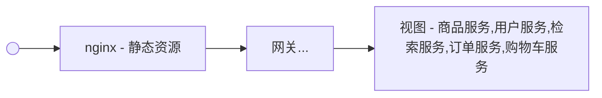

# 16.项目微服务



> 动静分离：
>
> 动：服务器需要处理的请求
>
> 静：图片、`js`、`css`等静态资源（以实际文件存在的方式）

> 每一个微服务都可以独立部署、运行、升级独立自治；技术，架构，业务

## 动静分离

- 引入`thymeleaf`模板引擎

  ```xml
  <!-- thymeleaf模板引擎 -->
  <dependency>
      <groupId>org.springframework.boot</groupId>
      <artifactId>spring-boot-starter-thymeleaf</artifactId>
  </dependency>
  ```

  

- 关闭缓存

  ```yaml
  spring:
    thymeleaf:
      cache: false
  ```

