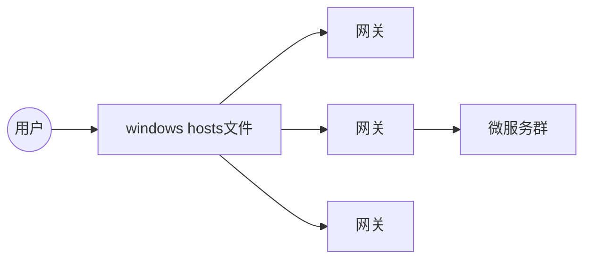

# 17.Nginx+Widowns搭建域名访问环境



- Nginx配置文件

  ```tex
  nginx.conf
  	全局块
  	events块
  	http块
  		http全局块
  		server块
  			location 
  			location
  ```

- 配置本地域名访问

  ```
  # ttmall
  192.168.56.105 ttmall.com
  ```

- Nginx配置

  ```shell
  server {
      listen       80;
      server_name  ttmall.com;
  
      location / {
        proxy_pass http://192.168.11.247:10000;
      }
      
      error_page   500 502 503 504  /50x.html;
      location = /50x.html {
          root   /usr/share/nginx/html;
      }
  }
  ```

  

- 负载均衡到网关

  ```shell
  # 负载均衡
  upstream ttmall {
      server 192.168.11.247:88;
  }
  ```

  ```shell
  locatoin {
      proxy_set_header Host $host
      proxy_pass http://ttmall;
  }
  ```

- 网关配置

  ```yaml
  spring:
    cloud:
      gateway:
        routes:
  		- id: ttmall_host_route
            uri: lb://ttmall-product
            predicates:
              - Host=**.ttmall.com,.ttmall.com
  ```

  > Nginx代理给网关的时候，会丢失请求的host信息
  >
  > ```shell
  > proxy_set_header Host $host
  > ```

