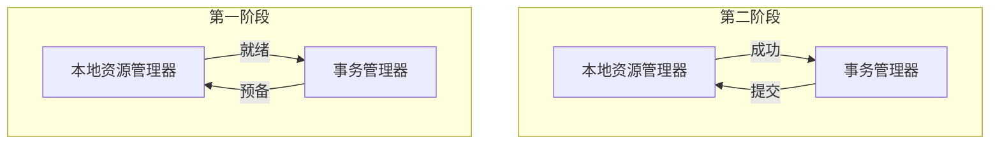

# 25.分布式事务

## 本地事务

### 事务的基本性质

数据库事务的几个特性：原子性（Atomicity）、一致性（Consistency）、隔离性或独立性（Isolation）和持久性（Durabilily）,简称就是ACID;

- 原子性：一系列的操作整体不可拆分，要么同时成功，要么同时失败
- 一致性：数据库在事务的前后，业务整体一致
  - 转账：`a:1000 b:1000 转200 事务成功；a：800 b：1200`
- 隔离性：事务之间相互隔离。
- 持久性：一旦事务成功，数据库一定会落盘在数据库。


在以往的单体应用中，我们多个业务操作使用同一条连接操作不同的数据表，一旦有异常，我们可以很容易的整体回滚；


Bussiness：我们具体的业务代码

Storage：库存业务代码；扣库存

Order：订单业务代码；保存订单

Account：账号业务代码；减帐户余额

比如买东西业务，扣库存，下订单，账户扣款，是一个整体；必须同时成功或者失败

一个事务开始，代表一下的所有操作都在同一个连接里面；

### 事务隔离级别

- READ_UNCOMMITTED（读未提交）

  该隔离级别的事务会读取到其它未提交事务的数据，此现象也成之为脏读。

- READ_COMMITTED（读提交）

  一个事务可以读取另一个已经提交的事务，多此读取会造成不一样的结果，此现象称为不可重复读问题，Oracle 和 SQL Server 的默认隔离级别。

- REPEATABLE_READ（可重复读）

  该隔离级别是MySQL默认的隔离级别，在同一个事务里，select的结果是事务开始时间点的状态，因此，同样的select操作读到的结果会是一致的，但是，会有幻读现象。MySQL的innoDB引擎可以通过next-key locks机制（参考下问"行锁的算法"一节）来避免幻读。

- SERUALIZABLE（序列化）

  在该隔离级别下事务都是串行顺序执行的，MySQL数据库的InnoDB引擎会给读操作隐式加一把读共享锁，从而避免了脏读、不可重复读和幻读问题。

### 事务的传播行为

- PROPAGATION_REQUIRED：如果当前没有事务，就创建一个新事务，如果当前存在事务，就加入该事务，该设置是最常用的设置。

- PROPAGATION_SUPPORTS：支持当前事务，如果当前存在事务，就加入该事务，如果当前不存在事务，就非事务执行。
- PROPAGATION_REQUIRES_NEW：创建新事务，无论当前存在不存在事务，都创建新事务。
- PROPAGATION_NEVER：以非事务方式执行，如果当前存在事务，则抛出异常。
- PROPAGATION_NESTED：如果当前存在事务，则在嵌套事务内执行。如果当前没有事务，则执行于PROPAGATION_REQUIRED类似的操作

```java
// 同一个对象内事务方法互调默认是失效，原因 绕过了代理对象
// 事务使用代理对象来控制的
@Transactional(timeout = 30) // a事务的所有设置就传播到了和他公用一个事务的方法
public a(){
    // 调用同一个类中的方法 该方法的事务是不生效的（需要调用其它类的事务方法才能生效）
    // b(); 没用  // a事务
    // c(); 没用 // 新事务（不回滚）
    int i = 10/0;
}

@Transactional(propagation = PROPAGATION.REQUIRED,timeout = 2)
public b(){
    
}

@Transactional(propagation = PROPAGATION.REQUIRES_NEW,timeout = 20)
public c(){
    
}
```

### 本地事务失效问题

同一个对象内事务方法互调默认失效，原因 绕过了代理对象，事务使用代理对象来控制的

解决：使用代理对象来调用事务方法

1. 引入aop-starter；spring-boot-starter-aop；引入了aspectj

2. @EnbleAspectJAutoProxy；开启aspectj动态代理功能。以后所有的动态代理都是aspectj创建的（即使没有接口）

   对外暴露代理对象

   ```java
   @EnableAspectJAutoProxy(exposeProxy = true)
   ```

3. 本类方法调用

   ```java
   xxxServiceImpl orderService = AopContext.currentProxy();
   orderService.b();
   orderService.c();
   ```

   

## 分布式事务


事务保证：

1. 订单服务异常，库存锁定不运行，全部回滚，撤销操作；
2. 库存服务事务自治，锁定失败全部回滚，订单感受到，继续回滚；
3. 库存服务锁定成功了，但是网络元婴返回数据途中问题？
4. 库存服务锁定成功了，库存服务下面的逻辑发生故障，订单回滚了，怎么处理？

利用消息队列实现最终一致

库存服务锁定成功后发给消息队列消息（当前库存工作单），过段时间自动解锁，解锁时先查询订单的支付状态。解锁成功修改库存工作单详情项状态为已解锁。

问题

1. 远程服务假失败：

   远程服务其实成功了，由于网络故障等没有返回

   导致：订单回滚，库存却扣减

2. 远程服务执行完成，下面的其他方法出现问题

   导致：已执行的远程请求，肯定不能回滚

   ```java
   @Transactional // 本地事务，在分布式系统，只能控制住自己的回滚，控制不了其它服务的回滚
   // 分布式事务：最大原因。网络问题+分布式机器
   ```

   

### 为什么有分布式事务

分布式系统经常出现的异常

机器宕机、网络异常、消息丢失、消息乱序、数据错误、不可靠的TCP、存储数据丢失...


分布式事务是企业集成中的一个技术难点，也是每一个分布式系统架构中都会涉及到的一个东西，特别是在微服务架构中，几乎可以说是无法避免。

### CAP定理

CAP原则又称为CAP定理，指的是在一个分布式系统中

- 一致性（Consistency）:

  - 在分布式系统中的所有数据备份，在同一时刻是否同样的值。（等同于所有节点访问同一份最新的而数据副本）

- 可用性（Availability）

  - 在集群中一部分节点故障后，集群整体是否还能响应客户端的读写请求。（对数据根性具备高可用性）

- 分区容错性（Partition tolerance）

  - 大多数分布式系统都分布在多个子网络。每个子网络就叫做一个区（partition）.

    分区容错的意思式，区间通信可能失败。比如，一台服务器放在中国，另一台服务器放在美国，这就是两个区，他们之间可能无法通讯。

  CAP原则指的式，这三个要素最多只能同时实现两点，不可能三者兼顾。


一般来说，分区容错无法避免，因此可以认为CAP的P总时成立。CAP定理告诉我们，剩下的C和A无法同时做到。

分布式系统中实现一致性的[raft算法](http://thesecretlivesofdata.com/raft/)

### 面临的问题

对于多数大型互联网应用的场景，主机众多、部署分散，而且现在的集群规模越来越大，所以节点故障、网络故障是常态，而且要赵正服务可用性达到99.99999%（N个9），即保证P和A，舍弃C。

### BASE理论

是对CAP理论的延伸，思想是即是无法发做到强一致性（CAP的一致性就是强一致性），即可以采用适当的采取弱一致性，即最终一致性。

BASE是指

- 基本可用（Basically Available）
  - 基本可用是指分布式系统在出现故障的时候，允许损失部分可用性（例如响应时间、功能上的可用性），允许损失部分可用性。需要注意的是，基本可用绝不等价于系统不可用。
    - 响应时间上的损失，正常情况下搜索引擎需要在0.5秒之内返回给用户相应的查询结果，但由于出现故障（比如系统部分机房发生断电或断网故障），查询结果的响应时间增加到了1~2秒。
    - 功能上的损失：购物网站在购物高峰（如双十一）时，为了保护系统的稳定性，部分消费者可能会被引导到一个降级页面。
- 软状态（Soft State）
  - 软状态是指允许系统存在中间状态，而该中间状态不会影响系统整体可用性。分布式存储中一般一份数据会有多个副本，允许不同副本同步的延时就是软状态的体现。mysql replication的异步复制也是一种体现。
- 最终一致性（Eventual Consistency）
  - 最终一致性是指系统中的所有数据副本经过一定时间后，最终能够达到一致的状态。弱一致性和强一致性相反，最终一致性是弱一致性的一种特殊情况。

### 强一致性、弱一致性、最终一致性

从客户端角度，多进程并发访问时，更新过的数据在不同进程如何获取的不同测率，决定了不同的一致性。对于关系型数据库，要求更新过的数据被后续的访问都能看到，这是强一致性。如果能容忍后续部分或者全部访问不道，则是弱一致性，如果经过一段时间后要求能访问到更新后的而数据，则是最终一致性。

### 分布式事务集中解决方案

#### 2PC模式

数据库支持2PC【2 phase commit 二阶提交】，又叫做XA Transactions。

MySQL从5.5版本开始支持，SQL Server 2005开始支持，Oracle 7开始支持。

其中，XA是一个两阶段提交协议，该协议分为一下两个阶段：

第一阶段：事务协调器要求每个涉及到事务的数据库预提交（precommit）此操作，并反映是否可以提交。

第二阶段：事务协调器要求每个数据库提交数据。

其中，如果有任何一个数据库否决此次提交，那么所有数据库都会被要求回滚它们在此事务中的那部分信息。



- XA协议比较简单，而且一旦商业数据库实现了XA协议，使用分布式事务的成本也比较低。
- XA性能不理想，特别是在交易下单链路，往往并发量很高，XA无法满足高并发场景
- XA实现，没有记录prepare阶段日志，主备切换回导致主库与备库数据不一致；
- 许多nosql也没有支持XA，这让XA的应用场景边得非常狭隘。
- 也有3PC，引入了超时机制（无论协调者还是参与者，在项对方发送请求后，若长时间未收到回应则做出相应处理）

#### 柔性事务 - TCC事务补偿型方案

刚性事务：遵循ACID原则，强一致性。

柔性事务：遵循BASE理论，最终一致性；

与刚性事务不同，柔性事务允许一定时间内，不同节点的数据不一致，但要求最终一致。


#### 柔性事务 - 最大努力通知型方案

按照规律进行通知，不保证数据一定能通知成功，但会提供可查询操作接口进行核对。这种方案主要用于在第三方系统通讯时，比如：调用微信或支付宝后的支付结果通知。这种方案也是结合MQ进行实现，例如：通过MQ发送http请求，设置最大通知次数。达到通知次数后即不再通知。

案例：银行通知、商户通知等（各大交易业务平台间的商户通知；多此通知、查询校对、对账文件），支付宝的支付成功异步回调。

#### 柔性事务 - 可靠消息 + 最终一致性方案（异步确保型）

实现：业务处理服务在业务事务提交之前，向实时消息服务请求发送消息，实时消息服务只记录消息数据，而不是真正的发送。业务处理服务在业务事务提交之后，向实时消息服务确认发送。只有在得到确认发送指令之后，实时消息服务才会真正发送。

## SEATA（分布式事务解决方案）


### 示例（2PC：不适用高并发模式）

- 业务代码添加注解

  ```java
  @GlobalTransactional
  ```

- 创建表（每个服务的数据库中）

  ```sql
  -- 注意此处0.3.0+ 增加唯一索引 ux_undo_log
  CREATE TABLE `undo_log` (
    `id` bigint(20) NOT NULL AUTO_INCREMENT,
    `branch_id` bigint(20) NOT NULL,
    `xid` varchar(100) NOT NULL,
    `context` varchar(128) NOT NULL,
    `rollback_info` longblob NOT NULL,
    `log_status` int(11) NOT NULL,
    `log_created` datetime NOT NULL,
    `log_modified` datetime NOT NULL,
    `ext` varchar(100) DEFAULT NULL,
    PRIMARY KEY (`id`),
    UNIQUE KEY `ux_undo_log` (`xid`,`branch_id`)
  ) ENGINE=InnoDB AUTO_INCREMENT=1 DEFAULT CHARSET=utf8;
  ```

- 启动服务（[安装SEATA服务器]()）

- 整合

  - 导入依赖`spring-cloud-starter-alibaba-seata`

    ```xml
    <!-- SEATA分布式事务解决方案 seata-all-0.7.1-->
    <dependency>
        <groupId>com.alibaba.cloud</groupId>
        <artifactId>spring-cloud-starter-alibaba-seata</artifactId>
    </dependency>
    ```

  - 解压并启动`seata-server`

    - 修改注册配置文件`register.conf`

      ```shell
      registry {
        # file 、nacos 、eureka、redis、zk、consul、etcd3、sofa
        type = "nacos"
      }
      
      config {
        # file、nacos 、apollo、zk、consul、etcd3
        # 可以将配置文件搬家至nacos
        type = "file"
      }
      ```

    - 修改配置文件`file.conf`

      ```shell
      # 日志存储在哪里 可以放入到文件中 或者 DB中
      ```

    - 开启SEATA - `seata-server.bat`（jdk1.8）

  - 所有想要用到分布式事务的微服务使用`SEATA DataSoureProxy`代理自己的数据源

    ```java
    import com.zaxxer.hikari.HikariDataSource;
    import io.seata.rm.datasource.DataSourceProxy;
    import org.springframework.beans.factory.annotation.Autowired;
    import org.springframework.boot.autoconfigure.jdbc.DataSourceProperties;
    import org.springframework.context.annotation.Bean;
    import org.springframework.context.annotation.Configuration;
    import org.springframework.util.StringUtils;
    
    import javax.sql.DataSource;
    
    @Configuration
    public class MySeataConfig {
    
        @Autowired
        DataSourceProperties dataSourceProperties;
    
        @Bean
        public DataSource dataSource(DataSourceProperties dataSourceProperties) {
            HikariDataSource dataSource = dataSourceProperties.initializeDataSourceBuilder().type(HikariDataSource.class).build();
            if (StringUtils.hasText(dataSourceProperties.getName())) {
                dataSource.setPoolName(dataSourceProperties.getName());
            }
            return new DataSourceProxy(dataSource);
        }
    
    }
    ```

  - 每个服务，都必须导入`registry.conf` `file.conf`

    > `file.conf`：vgroup_mapping.{application.name}-fescar-service-group = "default"

  - 启动测试分布式事务

  - 给分布式大事务的入口标注`@GloabalTransactional`
  - 每一个远程的小事务用`@Transactional`

## RabbitMQ延时队列（实现定时任务）

### 场景

比如未付款订单，超过一定时间后，系统自动取消订单并释放占有物品。

### 常用解决方案

spring的schedule定时任务轮询数据库

缺点：

消耗系统内存、增加了数据库的压力、存在较大的时间误差

解决：

rabbitmq的消息TTL和死信Exchange结合

### 延迟队列场景


### 定时任务的时效性问题


### 消息的TTL（Time To Live）

- 消息的TTL就是**消息的存活时间**；
- RabbitMQ可以对**队列**和**消息**分别设置TTL；
  - 对队列设置就是队列没有消费者连着的保留时间，**也可以对每一个单独的消息做单独的设置。超过了这个时间，我们任务这个消息就死了，称之为死信**；
  - 如果队列设置了，消息也设置了，那么就会**取小的**。所以一个消息如果被路由到不同的队列中，这个消息死亡的时间有可能不一样（不同的队列设置）。这里单讲单个消息的TTL，应为它才是实现延迟任务的关键。**可以通过设置消息的`expiration`字段或者`x-message-ttl`属性来设置时间**，两者是一样的效果。

### Dead Letter Exchanges（DLX）

- 一个消息在满足如下条件下，会进**死信路由**，记住这里是路由而不是队列，一个路由可以对应很对队列。（什么是死信）

  - 一个消息被Consumer拒收了，并且reject方法的参数里requeue是false。也就是说不会被再次放在队列里，被其它消费者使用。

    `（beasic.rehect/basic.nack）requeue=false`

  - 上面的消息的TTL到了，消息过期了。

  - 队列的长度限制满了。排在前面的消息会被丢弃或者扔到死信路由上

- Dead Letter Exchange 其实就是一个普通的exchange，和创建其它exchange没有两样。会自动触发消息的转发，发送到Dead Letter Exchange中去。
- 我们既可以控制消息在一段时间后变成死信，又可以可以控制变成死信的消息被路由到某一个指定的交换机，结合二者，其实就可以实现一个延迟队列。

### 延迟队列实现 - 1


### 延迟队列实现 - 2（存在惰性检查）


### 实现


- 创建`MyMQConfig`

  ```java
  import cn.tete.ttmall.order.entity.OrderEntity;
  import org.springframework.amqp.core.Binding;
  import org.springframework.amqp.core.Exchange;
  import org.springframework.amqp.core.Queue;
  import org.springframework.amqp.core.TopicExchange;
  import org.springframework.amqp.rabbit.annotation.RabbitListener;
  import org.springframework.context.annotation.Bean;
  import org.springframework.context.annotation.Configuration;
  
  import java.util.HashMap;
  import java.util.Map;
  
  @Configuration
  public class MyMQConfig {
  
      // @Bean Binding,Queue,Exchange
  
      /**
       * 容器中的 Binding,Queue,Exchange 都会自动创建（RebbitMQ没有的情况）
       * RabbitMQ 只要有 @Bean声明属性发生变化也不会覆盖
       */
      @Bean
      public Queue orderDelayQueue() {
          Map<String, Object> arguments = new HashMap<>();
          /**
           * x-dead-letter-exchange：order-event-exchange
           * x-dead-letter-routing-key：order.release.order
           * x-message-ttl：60000
           */
          arguments.put("x-dead-letter-exchange", "order-event-exchange");
          arguments.put("x-dead-letter-routing-key", "order.release.order");
          arguments.put("x-message-ttl", 60000);
  
          Queue queue = new Queue("order.delay.queue", true, false, false, arguments);
          return queue;
      }
  
      @Bean
      public Queue orderReleaseOrderQueue() {
          Queue queue = new Queue("order.release.order.queue", true, false, false);
          return queue;
      }
  
      @Bean
      public Exchange orderReleaseOrderExchange() {
          return new TopicExchange("order-event-exchange", true, false);
      }
  
      @Bean
      public Binding orderCreateOrderBingding() {
          // (String destination, Binding.DestinationType destinationType, String exchange, String routingKey, Map<String, Object> arguments)
          return new Binding(
                  "order.delay.queue",
                  Binding.DestinationType.QUEUE,
                  "order-event-exchange",
                  "order.create.order",
                  null
          );
      }
  
      @Bean
      public Binding orderReleaseOrderBingding() {
          return new Binding(
                  "order.release.order.queue",
                  Binding.DestinationType.QUEUE,
                  "order-event-exchange",
                  "order.release.create.order",
                  null
          );
      }
  
  }
  ```

  - 启动服务（查看rabbitMQ中是否产生响应的队列）

  - 测试

    - 创建响应方法

      ```java
       @RabbitListener(queues = "order.release.order.queue")
      public void listener(OrderEntity entity, Channel channel, Message message) throws IOException {
          System.out.println("收到过期的订单信息：准备关闭订单" + entity.getOrderSn());
          channel.basicAck(message.getMessageProperties().getDeliveryTag(), false);
      }
      ```

    - 创建请求

      ```java
      @Autowired
      RabbitTemplate rabbitTemplate;
      
      @GetMapping("/test/createOrder")
      @ResponseBody
      public String createOrderTest() {
          // 订单下单成功
          OrderEntity entity = new OrderEntity();
          entity.setOrderSn(UUID.randomUUID().toString());
          entity.setModifyTime(new Date());
      
          // 给MQ发送消息
          rabbitTemplate.convertAndSend("order-event-exchange", "order.create.order", entity);
          return "ok";
      }
      ```

      

    
